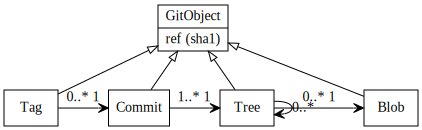

!SLIDE subsection
# Gestionnaire de contenu #

!SLIDE
.notes 1 036 lignes de C : seulement un système d'interrogation et de manipulation de cache

Gestion de contenu

!SLIDE
.notes Gestion d'un ensemble d'objets

# Tout est objet #

!SLIDE bullets
.notes tree = arborescence

* Tag
* Commit
* Tree
* Blob

!SLIDE bullets

!SLIDE
Tout est SHA-1

f642ecf40f686d4b7f6dc8224007aac0117c1d56

!SLIDE
Chaque état du fichier est enregistré

Le fichier est enregistré en entier

!SLIDE
.notes Ça prendrait trop de place !

!SLIDE
# NON !

!SLIDE bullets
  * L'objet Tree
    * Le chemin dans l'arborescence
    * La référence vers les blobs

!SLIDE
* Une fois un contenu = 1 tree + 1 blob
* N fois le même contenu = N trees + 1 blob

!SLIDE
.notes Je vous ai menti, compression à la MPEG : 1 snapshot, N diffs, 1 snapshot

Compression automatique des blobs par diff
