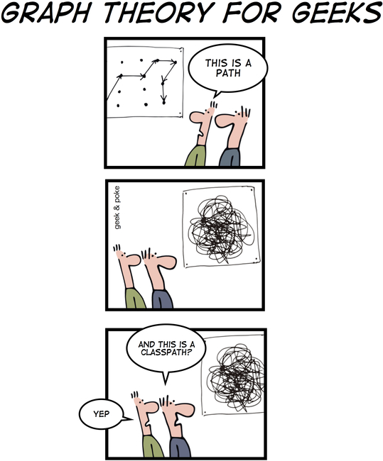
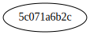
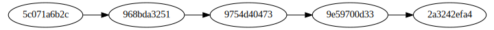
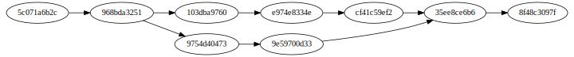

!SLIDE
.notes On va parler de dagues, oups pas ce genre

!SLIDE

!SLIDE subsection
.notes Utilisé pour organiser les commits

# Directed acyclic graph #

Graphe orienté acyclique

!SLIDE
Fait partie du backend

!SLIDE
.notes Rappel : tout est SHA-1

!SLIDE
# Chaque commit comprend
Un identifiant

!SLIDE
Un message associé

!SLIDE
Un auteur

!SLIDE
Un ensemble de références vers son tree, lui-même connaissant ses blobs

!SLIDE
Un ensemble de références vers ses ancêtres

!SLIDE
# Combien ?

!SLIDE
.notes 0 pour le premier commit

!SLIDE
.notes 1 pour les cas courants

!SLIDE
.notes N pour les merges, split = 2 commits avec un parent, merge = 1 commit avec un parent

!SLIDE
.notes Accéder à un commit n'est rien de plus qu'un déplacement dans le graphe et faire un commit revient à modifier le graphe

Un commit = un nœud du graphe

!SLIDE

!SLIDE
.notes Mais comment on y accède ?

