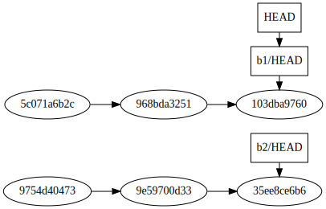
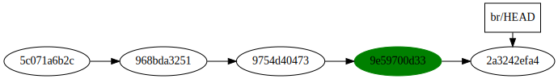
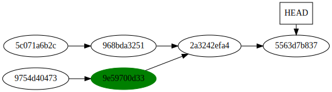
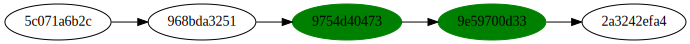
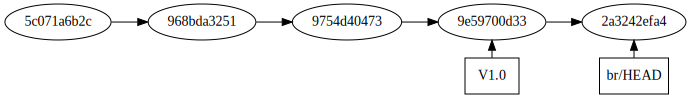
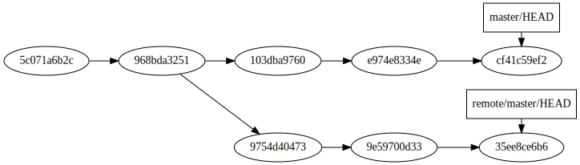

!SLIDE subsection
.notes Concept le plus dur à appréhender

# Références #

!SLIDE
Font parties du frontend

!SLIDE
# SHA-1

!SLIDE
.notes Peut être abrégé

8f48c3097fb9f09a8eefbb4ad2023638981e704c

8f48c

!SLIDE
Tout a une référence (fichier, commit, objets)

!SLIDE
Toute référence est unique

!SLIDE
.notes En partant de ce constat, comment sait-on où on est dans le graphe ? Indice : un commit ne pas connait sa branche

!SLIDE
.notes Le HEAD : dernier commit d'une branche

HEAD : dernier commit d'une branche

!SLIDE commandline
.notes HEAD : référence courante

	$ cat .git/HEAD
	ref: refs/heads/master

!SLIDE commandline
.notes Chaque branche a son HEAD

	$ cat .git/refs/heads/master
	35ee8ce6b66480fc67eea935431fad16a9ee44c0

!SLIDE

!SLIDE
Mini langage de manipulation

!SLIDE commandline
.notes Commit n-1 ; git show : voir un commit ; HEAD peut être n'importe quelle référence (Tag, SHA-1, etc.)

	$ git show HEAD~1

!SLIDE commandline
.notes 2ème parent

	$ git show HEAD^2

!SLIDE commandline
.notes Équivalents

	$ git show HEAD^1
	$ git show HEAD^
	$ git show HEAD

!SLIDE commandline
.notes Équivalents

	$ git show HEAD^2
	$ git show HEAD^^

!SLIDE commandline
.notes Interval ; log = liste des commits

	$ git log 968b..9e597

!SLIDE commandline
.notes Peut devenir complexe

	$ git log HEAD~8^3..HEAD~2^2

!SLIDE commandline
.notes Plusieurs types de références ; heads = branches

	$ ls .git/refs
	heads
	remotes
	tags

!SLIDE
# Tags

!SLIDE
.notes Moyen d'accès rapide à un commit ; un tag/une branche n'est qu'un fichier contenant un SHA-1, il ne coûte que 40 octets

!SLIDE
Différence entre un HEAD et un Tag ?

!SLIDE
.notes HEAD est déplacé automatiquement, Tag manuellement

L'utilisateur !

!SLIDE
.notes Rappel : un commit ne connait que son/ses ancêtre(s)

Mais le Dag ?

!SLIDE
.notes Quand une référence est perdue à jamais, elle est supprimée. Il y a un ramasse-miettes qui supprime toutes les références inaccessibles au bout d'un certain temps.

!SLIDE
.notes Outil le plus puissant de git disponible uniquement sur git et Darc

# Remotes

!SLIDE
.notes S'ajoute au Dag

1 seul Dag

!SLIDE
.notes Notions importantes

# Namespaces

!SLIDE
.notes On ajoute un remote puis on fetch (réception) ou on push (envoi)

  * fetch
  * push

!SLIDE
  * pull = fetch + merge
  * push

!SLIDE
Une branche à la fois

!SLIDE commandline
.notes Rappel

	$ cat .git/HEAD
	ref: refs/heads/master

!SLIDE
# Alias

!SLIDE commandline
.notes master devient origin/b2

	$ git pull origin master:origin/b2
	$ git push origin master:origin/b2

!SLIDE
.notes De manière générale

\<source\>:\<destination\>

!SLIDE commandline
.notes Attention : supprime la branche

	$ git push origin :origin/b2
