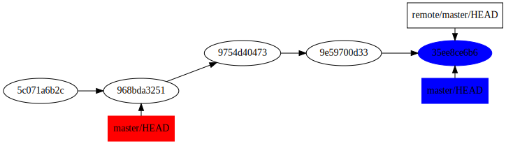
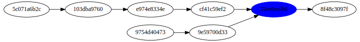
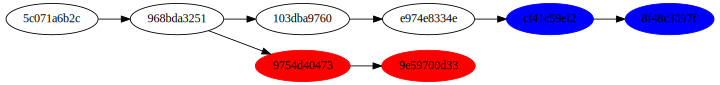

!SLIDE subsection
# Fusion et stratégies #

!SLIDE commandline
.notes La fusion de instable et master crée un commit

	$ git merge instable

!SLIDE commandline
.notes Plus fort : fusion de stable, instable et master

	$ git merge master stable instable

!SLIDE bullets
.notes Fast forward par défaut sur merge, et commit sur pull ; les plus utilisés en haut

  * Fast forward (--ff)
  * Commit (--commit)
  * Rebase (rebase)

!SLIDE

!SLIDE

!SLIDE
.notes ... ; En cas de conflit, on le résout commit par commit ; utilisez

!SLIDE commandline
.notes Sinon ça rajoute des commits inutiles au Dag

	$ git pull --rebase
