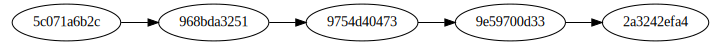

!SLIDE
.notes on va parler de dagues, oups pas ce genre

!SLIDE

!SLIDE subsection
.notes Utilisé pour organiser les commits

# Directed acyclic graph #

Graphe orienté acyclique

!SLIDE
Fait partie du Back-end

!SLIDE
.notes rappel tout est SHA1

!SLIDE
# Chaque commit comprends
Un identifiant

!SLIDE
Un message associé

!SLIDE
Un auteur

!SLIDE
Un ensemble de références vers son tree lui même connaissant ses blobs

!SLIDE
Un ensemble de références vers ses ancêtres

!SLIDE
# Combien ?

!SLIDE
.notes 0 pour le premier commit

!SLIDE
.notes 1 pour les cas courrants

!SLIDE
.notes n pour les merges, split = 2 commits avec un parent, merge = 1 commit avec un parent

!SLIDE
.notes acceder à un commit n'est rien de plus qu'un déplacement dans le graphe et faire un commit revient à modifier le graphe

Un commit = un noeud du graphe

!SLIDE

!SLIDE
.notes mais comment on y accède ?

