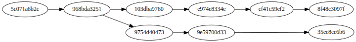
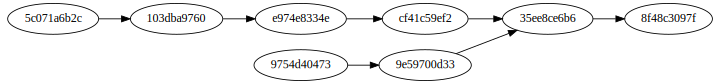

!SLIDE subsection
# Déplacement #

!SLIDE commandline
.notes liste les branches
	$ git branch

!SLIDE commandline
.notes pas de commit
	$ git checkout -b mybranch
ou
	$ git branch mybranch
	$ git checkout mybranch

!SLIDE 
.notes 

!SLIDE commandline
.notes Renomme (la branche courante par défaut)
	$ git branch -m [ancien] nouveau

!SLIDE commandline
.notes Supprime (la branche courante par défaut)
	$ git branch -D [branche]

!SLIDE commandline
.notes Fusionne (la branche courante reçoit par défaut)
	$ git merge [A] B

!SLIDE 
.notes 

!SLIDE commandline
.notes detached HEAD (un checkout -b résout le soucis)
	$ git checkout HEAD~10
	$ vi main.c
	$ git commit main.c
[detached HEAD 20b7c9c]
 main.c
 1 file changed, 1 insertion(+)

!SLIDE 

