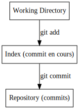

!SLIDE subsection
.notes concept le plus dur à retenir

# Niveaux #

!SLIDE
.notes Rappel : Git est un simple gestionnaire de cache

!SLIDE commandline
.notes ajoute main.c à l'index

	$ git add main.c

!SLIDE commandline
.notes Crée un commit à partir de l'index; Crée un commit à partir du working directory

	$ git commit
	$ git commit -a

!SLIDE commandline
.notes ajoute main.c à l'index

	$ git add main.c

!SLIDE commandline
.notes différence par rapport au répository (dernier commit)

	$ git diff main.c

!SLIDE commandline
.notes différence par rapport à l'index (commit courant)

	$ git diff --cached main.c

!SLIDE commandline
.notes affiche l'état des fichiers / wat ?! / le premier est l'index, l'autre le workind directory

	$ git add main.c
	$ vi main.c
	$ git status
	# On branch master
	# Changes to be committed:
	#   (use "git reset HEAD <file>..." to unstage)
	#
	#	modified:   main.c
	#
	# Changes not staged for commit:
	#   (use "git add <file>..." to update what will be committed)
	#   (use "git checkout -- <file>..." to discard changes in working directory)
	#
	#	modified:   main.c
	#

!SLIDE 
# Stash

!SLIDE bullets
  * Espace temporaire
  * Extrait les modification du working directory
  * Peu utilisé en faveur des branches

