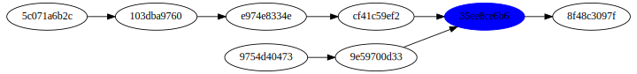

!SLIDE subsection
# Fusion et stratégies #

!SLIDE commandline
.notes fusionne instable et master : crée un commit

	$ git merge instable

!SLIDE commandline
.notes plus fort : fusionne stable, instable et master

	$ git merge master stable instable

!SLIDE bullets
.notes fast forward par défaut sur merge, et commit sur pull ; les plus utilisés en haut

  * FastForward (--ff)
  * Commit (--commit)
  * Rebase (rebase)

!SLIDE

!SLIDE

!SLIDE
.notes ...; en cas de conflit, on le résout commit par commit; utilisez

!SLIDE commandline
.notes si non ça rajoute des commits inutiles au dag

	$git pull --rebase
